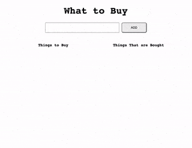

# Shopping APP

---
**Title**: Shopping App <br>
**Type**: Homework<br>
**Duration**: lab + hw time<br>
**Competencies**: jQuery, Javascript, DOM <br>

---

# WHAT TO BUY?


## Shopping List

Build a shopping list app with two columns: one for things to buy, and another for things that have been purchased. Use jQuery to give your app functionality.

### User Stories
Your user should be able to:

* Enter an item in the input box, and click the 'add' button to have the item render in the to-buy-list column.

* Click on a button within the to-buy-list to move that item over to a 'purchased' column.

* Click that same button, after it's been moved to 'purchased', the button should now say 'remove', to remove the item from the page.

* The app's UI should be intuitive and some CSS is required to make two columns to easily distinguish the two lists. Additional formatting of the form and color coding different aspects of the app should also be considered. 

<details><summary>APP DEMO</summary>



</details>

## Commits

- Make sure to commit after each block of code that you create. Give an appropriate comment.

## Getting Started

- Set up your html, css, and js - make sure they are all linked
- start by adding only the most minimal CSS (changing background color to make sure files are linked correctly)
- Remember to add your document on ready/ document on load:

```js
$(() => {

	// DOM stuff

})
```

Remember the general flow of what is happening. The user makes an action, you run some code in order to process this action, the results of the action are rendered to the page, and then you wait until another action takes place.

Take the time to pseudo code and draw out a flow chart, so that you have a plan before coding.


## Hungry for More

### Local Storage

The browser has something called [local storage](https://developer.mozilla.org/en-US/docs/Web/Guide/API/DOM/Storage). This allows us to cache data in the browser. Using local storage, make this application remember the to-dos that have already been entered in, even if the page is closed.

### EDIT

#### Part 1:
Put stuff back into the buy list

#### Part 2:

Be able to edit the item after being added


### Draggable/Droppable

Look into jQuery's supplemental libraries like [Draggable and/or Droppable](https://jqueryui.com/droppable/)

### Lab
Finish today's labs.
