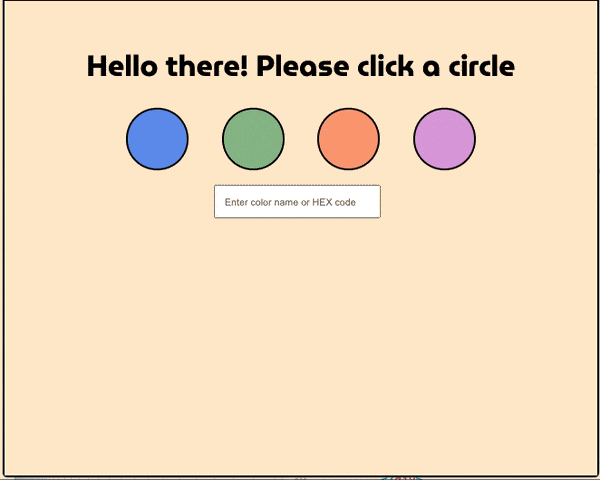

# Lab - Color Clicker

### Setup

1. Navigate to todays lab directory and cd into the provided starter code.
1. Open the starter code in atom.

### Part 1

1. Given the 4 circles make it so that when you click on the circle the background color of the div changes (Hint: use state)

   

     
Hints

   1. add a click event for each circle that will log the value of the id of the circle (hint: target the event) , (hint: the ids are valid [html colors](https://htmlcolorcodes.com/color-names/) )
   1. Create initial state for `containerColor` - set it to `blanchedalmond` to test that your container background is being set from state
   1. update the `style` attribute in the `div` with the class of `container` so that the `backgroundColor` is set from state, rather than hard coded.
   1. Upgrade the function that changes the state based on the id of the element.
   1. Attach an onClick with the previous function to each circle div.
      

### Part 2

1. Use the input given so you are able to type a valid CSS color name or HEX code (user must include `#` if using a HEX code) and have the background of the div change based on the color typed.
   

     
Hints

1. Create a function that grabs the text from the input and sets the state.
1. Attach a keyUp to the input with the previous function.
   

### HFM

- make a reset button
- create an array of valid html circles and make new circles based on those values to click on
- make a button that generates a random valid hex number
- make an input with type color and update the background that way
